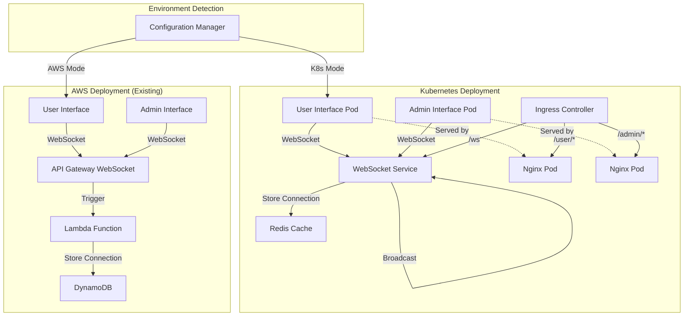

# Design Document

## Overview

The Kubernetes deployment system extends the existing user-admin-messaging application to support containerized deployment on Kubernetes clusters while maintaining full compatibility with the existing AWS serverless deployment. The design implements a dual-mode architecture that automatically adapts to the deployment environment, providing seamless operation in both AWS Lambda/API Gateway and Kubernetes environments.

## Architecture

The system follows a hybrid architecture pattern that supports both serverless and containerized deployments:



### Core Architecture Principles

- **Environment Agnostic**: Single codebase that adapts to deployment environment
- **Container-First for K8s**: Optimized Docker containers for Kubernetes deployment
- **Service Discovery**: Native Kubernetes service discovery and DNS
- **Horizontal Scaling**: Pod autoscaling based on CPU and connection metrics
- **Configuration Management**: Environment-specific configuration via ConfigMaps and Secrets
- **Health Monitoring**: Kubernetes-native health checks and monitoring

## Components and Interfaces

### Containerized Components

#### WebSocket Service Container
- **Base Image**: Node.js 18 Alpine for minimal size
- **Purpose**: Handles WebSocket connections and message routing
- **Ports**: 
  - 8080: WebSocket server
  - 8081: Health check endpoint
- **Environment Variables**:
  - `DEPLOYMENT_MODE`: "kubernetes" or "aws"
  - `REDIS_URL`: Redis connection string for K8s mode
  - `PORT`: WebSocket server port
- **Health Checks**: HTTP endpoint for liveness and readiness probes

#### Frontend Service Containers
- **Base Image**: Nginx Alpine for static file serving
- **Purpose**: Serve user and admin interfaces as static files
- **Ports**: 80 (HTTP)
- **Configuration**: Nginx config with proper MIME types and caching headers
- **Build Process**: Multi-stage build with TypeScript compilation

### Kubernetes Resources

#### Deployments
```yaml
# WebSocket Service Deployment
apiVersion: apps/v1
kind: Deployment
metadata:
  name: websocket-service
spec:
  replicas: 2
  selector:
    matchLabels:
      app: websocket-service
  template:
    spec:
      containers:
      - name: websocket
        image: user-admin-messaging/websocket:latest
        ports:
        - containerPort: 8080
        - containerPort: 8081
        env:
        - name: DEPLOYMENT_MODE
          value: "kubernetes"
        - name: REDIS_URL
          valueFrom:
            configMapKeyRef:
              name: app-config
              key: redis-url
        livenessProbe:
          httpGet:
            path: /health
            port: 8081
        readinessProbe:
          httpGet:
            path: /ready
            port: 8081
```

#### Services
- **WebSocket Service**: ClusterIP service for internal WebSocket communication
- **Frontend Services**: ClusterIP services for user and admin interfaces
- **Redis Service**: ClusterIP service for Redis cache

#### Ingress Configuration
```yaml
apiVersion: networking.k8s.io/v1
kind: Ingress
metadata:
  name: user-admin-messaging-ingress
  annotations:
    nginx.ingress.kubernetes.io/websocket-services: "websocket-service"
spec:
  rules:
  - host: clc.lockhead.cloud
    http:
      paths:
      - path: /user
        pathType: Prefix
        backend:
          service:
            name: user-frontend-service
            port:
              number: 80
      - path: /admin
        pathType: Prefix
        backend:
          service:
            name: admin-frontend-service
            port:
              number: 80
      - path: /ws
        pathType: Prefix
        backend:
          service:
            name: websocket-service
            port:
              number: 8080
```

### Environment Detection and Configuration

#### Configuration Manager
- **Purpose**: Detect deployment environment and provide appropriate configuration
- **Implementation**: Environment variable-based detection with fallback logic
- **Configuration Sources**:
  - Kubernetes: ConfigMaps and Secrets
  - AWS: Environment variables from Lambda/CDK
- **Runtime Adaptation**: Different connection managers for Redis vs DynamoDB

#### Environment-Specific Adapters
```typescript
interface ConnectionManager {
  storeConnection(connectionId: string, type: string): Promise<void>;
  removeConnection(connectionId: string): Promise<void>;
  getConnections(type: string): Promise<string[]>;
}

class KubernetesConnectionManager implements ConnectionManager {
  // Redis-based implementation
}

class AWSConnectionManager implements ConnectionManager {
  // DynamoDB-based implementation
}
```

### Data Storage Adaptation

#### Kubernetes Mode - Redis Cache
- **Purpose**: Store WebSocket connection state in Kubernetes environment
- **Implementation**: Redis cluster for high availability
- **Data Structure**:
  - Key: `connection:{connectionId}`
  - Value: JSON object with connection metadata
  - TTL: 24 hours for automatic cleanup

#### AWS Mode - DynamoDB (Existing)
- **Purpose**: Maintain existing DynamoDB-based connection storage
- **Implementation**: Unchanged from current design
- **Compatibility**: Full backward compatibility with existing deployment

## Docker Container Design

### Multi-Stage Build Strategy

#### WebSocket Service Dockerfile
```dockerfile
# Build stage
FROM node:18-alpine AS builder
WORKDIR /app
COPY package*.json ./
RUN npm ci --only=production

COPY src/ ./src/
COPY tsconfig.json ./
RUN npm run build

# Production stage
FROM node:18-alpine AS production
WORKDIR /app
COPY --from=builder /app/node_modules ./node_modules
COPY --from=builder /app/dist ./dist
COPY package.json ./

EXPOSE 8080 8081
USER node
CMD ["node", "dist/server.js"]
```

#### Frontend Dockerfile
```dockerfile
# Build stage
FROM node:18-alpine AS builder
WORKDIR /app
COPY package*.json ./
RUN npm ci

COPY src/ ./src/
COPY tsconfig.json ./
RUN npm run build

# Production stage
FROM nginx:alpine AS production
COPY --from=builder /app/dist /usr/share/nginx/html
COPY nginx.conf /etc/nginx/nginx.conf
EXPOSE 80
CMD ["nginx", "-g", "daemon off;"]
```

### Container Optimization
- **Image Size**: Multi-stage builds to minimize production image size
- **Security**: Non-root user execution, minimal base images
- **Caching**: Optimized layer caching for faster builds
- **Health Checks**: Built-in health check endpoints

## Kubernetes Deployment Configuration

### Resource Management
- **CPU Requests**: 100m for WebSocket service, 50m for frontend services
- **Memory Requests**: 128Mi for WebSocket service, 64Mi for frontend services
- **CPU Limits**: 500m for WebSocket service, 100m for frontend services
- **Memory Limits**: 512Mi for WebSocket service, 128Mi for frontend services

### Horizontal Pod Autoscaler
```yaml
apiVersion: autoscaling/v2
kind: HorizontalPodAutoscaler
metadata:
  name: websocket-service-hpa
spec:
  scaleTargetRef:
    apiVersion: apps/v1
    kind: Deployment
    name: websocket-service
  minReplicas: 2
  maxReplicas: 10
  metrics:
  - type: Resource
    resource:
      name: cpu
      target:
        type: Utilization
        averageUtilization: 70
  - type: Resource
    resource:
      name: memory
      target:
        type: Utilization
        averageUtilization: 80
```

### ConfigMaps and Secrets
- **app-config ConfigMap**: Non-sensitive configuration values
- **app-secrets Secret**: Sensitive configuration like Redis passwords
- **Environment-specific**: Separate configs for dev/staging/prod

## Error Handling and Resilience

### Kubernetes-Specific Error Handling
- **Pod Failures**: Automatic pod restart and replacement
- **Service Discovery**: Graceful handling of service endpoint changes
- **Redis Connectivity**: Connection pooling and retry logic
- **Health Checks**: Proper liveness and readiness probe implementation

### Graceful Shutdown
- **SIGTERM Handling**: Proper cleanup of WebSocket connections
- **Connection Draining**: Allow existing connections to complete
- **Timeout Management**: Configurable shutdown timeout

### Monitoring and Observability
- **Prometheus Metrics**: Custom metrics for WebSocket connections and message throughput
- **Logging**: Structured JSON logging for Kubernetes log aggregation
- **Distributed Tracing**: OpenTelemetry integration for request tracing

## Testing Strategy

### Container Testing
- **Unit Tests**: Test business logic in isolation
- **Integration Tests**: Test Redis connectivity and WebSocket functionality
- **Container Tests**: Test Docker image functionality and health checks

### Kubernetes Testing
- **Manifest Validation**: Validate Kubernetes YAML syntax and best practices
- **Deployment Testing**: Test deployment in local Kubernetes cluster (kind/minikube)
- **End-to-End Testing**: Full user journey testing in Kubernetes environment

### Compatibility Testing
- **Dual Mode Testing**: Ensure application works in both AWS and Kubernetes modes
- **Configuration Testing**: Validate environment detection and configuration loading
- **Migration Testing**: Test switching between deployment modes

## Security Considerations

### Container Security
- **Base Image Security**: Regular security scanning of base images
- **Non-Root Execution**: All containers run as non-root users
- **Minimal Attack Surface**: Only necessary packages in production images
- **Secret Management**: Proper handling of sensitive configuration

### Kubernetes Security
- **Network Policies**: Restrict pod-to-pod communication
- **RBAC**: Minimal required permissions for service accounts
- **Pod Security Standards**: Enforce security policies at pod level
- **Ingress Security**: TLS termination and proper routing rules

### Runtime Security
- **Resource Limits**: Prevent resource exhaustion attacks
- **Health Monitoring**: Detect and respond to unhealthy containers
- **Audit Logging**: Track deployment and configuration changes

## Performance Requirements

### Kubernetes Performance Targets
- **Pod Startup Time**: < 30 seconds for WebSocket service
- **Connection Establishment**: < 2 seconds for WebSocket connections
- **Message Latency**: < 500ms for message delivery
- **Horizontal Scaling**: Scale up within 60 seconds of load increase

### Resource Efficiency
- **Memory Usage**: < 256Mi per WebSocket service pod under normal load
- **CPU Usage**: < 200m per WebSocket service pod under normal load
- **Network Throughput**: Support 1000+ concurrent WebSocket connections per pod

## Deployment Strategy

### Build and Deployment Pipeline
1. **Code Changes**: Developer commits code changes
2. **Container Build**: Automated Docker image building with tags
3. **Image Registry**: Push images to container registry
4. **Kubernetes Deployment**: Apply Kubernetes manifests
5. **Health Verification**: Validate deployment health and functionality

### Environment Management
- **Development**: Local Kubernetes cluster (kind/minikube)
- **Staging**: Shared Kubernetes cluster with staging namespace
- **Production**: Dedicated production Kubernetes cluster
- **Configuration**: Environment-specific ConfigMaps and Secrets

### Rollback Strategy
- **Rolling Updates**: Zero-downtime deployments with rolling updates
- **Rollback Capability**: Quick rollback to previous working version
- **Health Monitoring**: Automatic rollback on health check failures
- **Manual Override**: Manual rollback capability for emergency situations

## Migration and Compatibility

### Dual Deployment Support
- **Parallel Operation**: Both AWS and Kubernetes deployments can coexist
- **Feature Parity**: Identical functionality across both deployment modes
- **Configuration Compatibility**: Shared configuration format where possible
- **Testing Compatibility**: Same test suite runs against both deployments

### Migration Path
1. **Phase 1**: Implement Kubernetes deployment alongside existing AWS deployment
2. **Phase 2**: Test and validate Kubernetes deployment in staging environment
3. **Phase 3**: Gradual traffic migration from AWS to Kubernetes
4. **Phase 4**: Full migration to Kubernetes with AWS deployment as backup