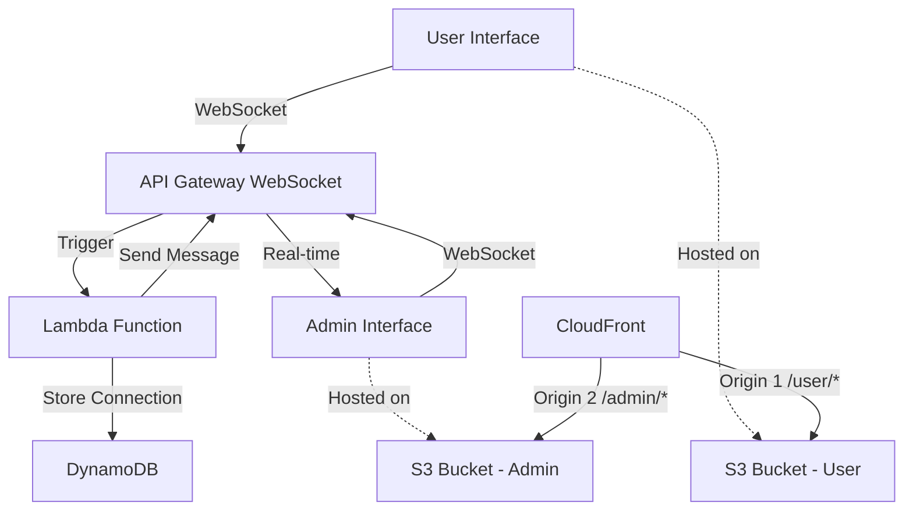

# Design Document

## Overview

The User-Admin Messaging application is a serverless web application deployed on AWS that enables real-time communication between a public user interface and an administrative interface. The system uses WebSocket connections for real-time messaging, AWS Lambda for serverless compute, and static web hosting for the frontend interfaces.

## Architecture

The application follows a serverless architecture pattern with the following key components:



### Core Architecture Principles

- **Serverless-first**: Utilize AWS Lambda and managed services to minimize operational overhead
- **Real-time communication**: WebSocket connections for immediate message delivery
- **Stateless design**: Connection state managed in DynamoDB
- **Static hosting**: Frontend applications served from S3 with CloudFront CDN
- **Infrastructure as Code**: Complete AWS infrastructure defined using CDK

## Components and Interfaces

### Frontend Components

#### User Interface
- **Technology**: Vanilla TypeScript with HTML/CSS
- **Functionality**: Single button that sends predefined message
- **WebSocket Client**: Establishes connection to API Gateway WebSocket endpoint
- **User Feedback**: Visual confirmation of button press and message sending

#### Admin Interface  
- **Technology**: Vanilla TypeScript with HTML/CSS
- **Functionality**: Real-time message display with chronological listing
- **WebSocket Client**: Maintains persistent connection for receiving messages
- **Message Display**: Auto-updating list showing timestamp and message content

### Backend Components

#### API Gateway WebSocket API
- **Purpose**: Manages WebSocket connections and routes messages
- **Routes**:
  - `$connect`: Handle new WebSocket connections
  - `$disconnect`: Clean up disconnected clients
  - `sendMessage`: Process incoming messages from user interface
- **Integration**: Direct integration with Lambda functions

#### Lambda Functions

##### Connection Manager Function
- **Trigger**: API Gateway WebSocket $connect/$disconnect routes
- **Purpose**: Store and remove connection IDs in DynamoDB
- **Runtime**: Node.js with TypeScript

##### Message Handler Function  
- **Trigger**: API Gateway WebSocket sendMessage route
- **Purpose**: Process messages and broadcast to admin connections
- **Runtime**: Node.js with TypeScript
- **Logic**:
  1. Receive message from user interface
  2. Query DynamoDB for admin connections
  3. Send message to all admin connections via API Gateway

#### DynamoDB Table
- **Purpose**: Store active WebSocket connection IDs
- **Schema**:
  - `connectionId` (String, Primary Key): WebSocket connection identifier
  - `connectionType` (String): Either "user" or "admin"
  - `timestamp` (Number): Connection establishment time
- **TTL**: Automatic cleanup of stale connections

### AWS Infrastructure Components

#### S3 Buckets
- **User Interface Bucket**: Hosts static files for user interface
- **Admin Interface Bucket**: Hosts static files for admin interface
- **Configuration**: Public read access, website hosting enabled

#### CloudFront Distribution
- **Purpose**: Single CDN distribution for improved performance and HTTPS termination
- **Configuration**: 
  - Single CloudFront distribution with two origins
  - Origin 1: User Interface S3 bucket (path pattern: `/user/*`)
  - Origin 2: Admin Interface S3 bucket (path pattern: `/admin/*`)
  - Default behavior routes to user interface
  - Custom domain support

#### IAM Roles and Policies
- **Lambda Execution Role**: Permissions for DynamoDB access and API Gateway management
- **Deployment Role**: CDK deployment permissions

## Data Models

### WebSocket Connection
```typescript
interface WebSocketConnection {
  connectionId: string;
  connectionType: 'user' | 'admin';
  timestamp: number;
}
```

### Message
```typescript
interface Message {
  content: string;
  timestamp: number;
  connectionId: string;
}
```

### API Gateway Message Format
```typescript
interface WebSocketMessage {
  action: 'sendMessage';
  data: {
    content: string;
  };
}
```

## Error Handling

### Frontend Error Handling
- **WebSocket Connection Failures**: Automatic retry with exponential backoff
- **Message Send Failures**: User notification and retry option
- **Network Disconnection**: Automatic reconnection attempts

### Backend Error Handling
- **Lambda Function Errors**: CloudWatch logging and error responses
- **DynamoDB Errors**: Graceful degradation and retry logic
- **API Gateway Errors**: Proper HTTP status codes and error messages

### Monitoring and Logging
- **CloudWatch Logs**: All Lambda function execution logs
- **CloudWatch Metrics**: WebSocket connection counts and message throughput
- **X-Ray Tracing**: Distributed tracing for debugging

## Testing Strategy

### Unit Testing
- **Frontend**: Jest tests for WebSocket client logic and UI interactions
- **Backend**: Jest tests for Lambda function business logic
- **Infrastructure**: CDK unit tests for construct validation

### Integration Testing
- **WebSocket Flow**: End-to-end message flow from user to admin
- **AWS Services**: Integration between Lambda, DynamoDB, and API Gateway
- **Deployment**: CDK deployment validation in test environment

### Manual Testing
- **Cross-browser Compatibility**: Testing on major browsers
- **Real-time Performance**: Message delivery latency validation
- **Concurrent Users**: Multiple simultaneous connections testing

## Security Considerations

### Network Security
- **HTTPS/WSS**: All connections encrypted in transit
- **CORS**: Proper cross-origin resource sharing configuration
- **Rate Limiting**: API Gateway throttling to prevent abuse

### Access Control
- **No Authentication**: Intentionally public access as per requirements
- **Resource Isolation**: Separate S3 buckets and CloudFront distributions
- **Least Privilege**: Minimal IAM permissions for Lambda functions

## Performance Requirements

### Response Times
- **Button Press Feedback**: < 500ms visual confirmation
- **Message Delivery**: < 2 seconds from user to admin interface
- **WebSocket Connection**: < 3 seconds establishment time

### Scalability
- **Concurrent Connections**: Support for 100+ simultaneous WebSocket connections
- **Message Throughput**: Handle 1000+ messages per minute
- **Auto-scaling**: Lambda functions scale automatically with demand

## Deployment Strategy

### CDK Stack Organization
- **Infrastructure Stack**: Core AWS resources (API Gateway, Lambda, DynamoDB)
- **Frontend Stack**: S3 buckets and single CloudFront distribution with multiple origins
- **Monitoring Stack**: CloudWatch dashboards and alarms

### Environment Management
- **Development**: Single AWS account with dev prefix
- **Production**: Separate AWS account or region
- **Configuration**: Environment-specific parameters via CDK context